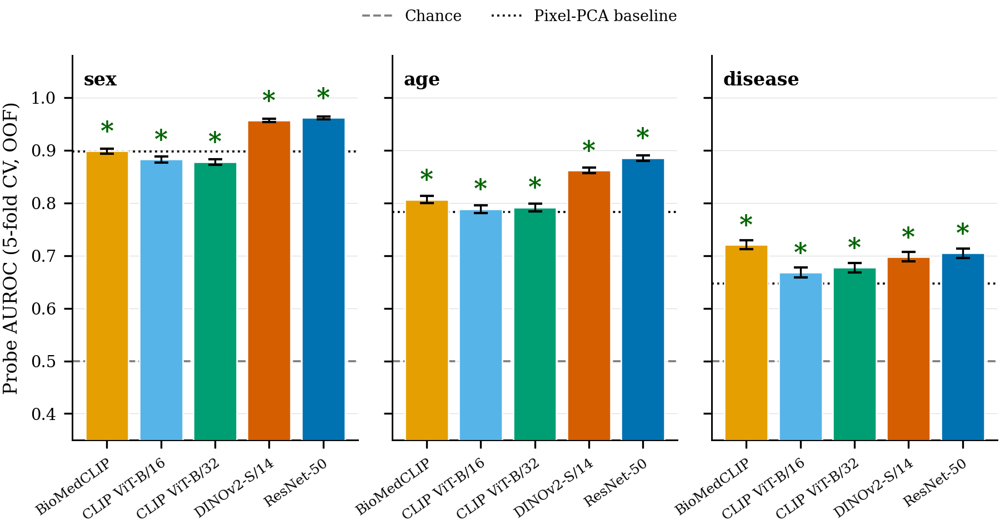
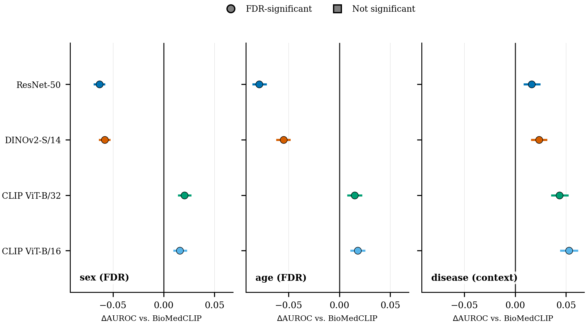
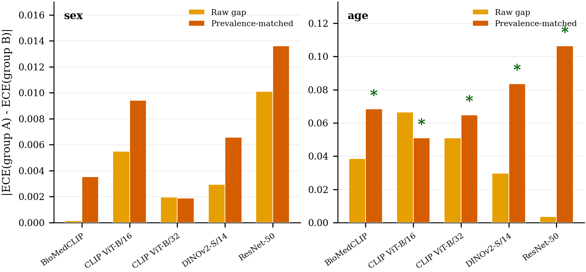
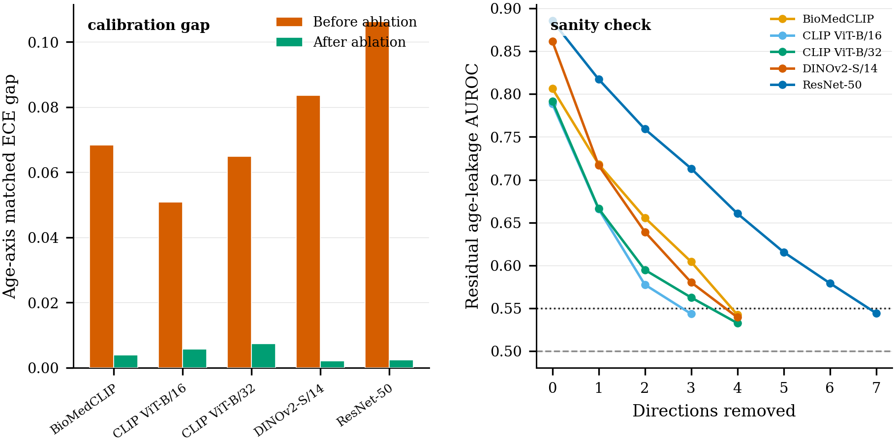

<div align="center">

# What Your CXR Reveals Beyond the Pathology

### Causal Evidence for Demographic Leakage in Medical Foundation Model Embeddings and Its Calibration Fairness Consequences

**ECCV 2026 Workshop on Medical Foundation Models and Benchmarks (MEDFMB)**

[](LICENSE)
[]()
[]()

*This repository is anonymized for double-blind review. No author names, affiliations, or identifying information are included.*

</div>

---

## Table of Contents

- [TL;DR](#tldr)
- [Key Findings](#key-findings)
- [Headline Results](#headline-results)
- [Models & Data](#models--data)
- [Repository Structure](#repository-structure)
- [Reproducing the Results](#reproducing-the-results)
- [Method Summary](#method-summary)
- [Embeddings](#embeddings)
- [Citation](#citation)
- [License](#license)

---

## TL;DR

Frozen chest X-ray embeddings from five pretrained foundation models leak patient **sex** and **age** far above chance — and this leakage is not merely correlated with downstream calibration unfairness, it **causes** it. Surgically removing the age-encoding direction from each model's embedding space (via iterative nullspace projection) cuts the age-calibration gap by **88–98%** across all five models. The strongest predictor of how much a model leaks turns out to be its **pretraining objective**, not whether it was trained on medical images.

## Key Findings

| # | Hypothesis | Finding | Evidence |
|---|---|---|---|
| **H1** | Leakage exists | All five models leak sex and age significantly above chance | 30/30 tests FDR-significant (Benjamini–Hochberg, *q* = 0.05) across NIH ChestX-ray14 + CheXpert |
| **H2** | Objective beats domain | Contrastive text-supervised models (BioMedCLIP, CLIP) leak *less* than self-/fully-supervised models (DINOv2, ResNet-50) — regardless of training domain | 8/8 NIH comparisons FDR-significant; 7/8 replicate on CheXpert |
| **H3a** | Calibration gap is age-specific | Age-axis calibration gap significant for all five models on both datasets; sex-axis gap consistently null | Matched ECE gap: 0.051–0.106 (NIH), 0.105–0.171 (CheXpert) |
| **H3b** | Leakage rank predicts gap rank *(exploratory)* | Perfect rank correlation between age-leakage and calibration gap | Spearman ρ = 1.00 (NIH), ρ = 0.90 (CheXpert); stable under leave-one-out jackknife |
| **H4** | Causal ablation | Removing the age-decoding direction reduces the calibration gap | 88.5–97.8% gap reduction across all five models; residual leakage AUROC drops to ≈0.53–0.54 |

Full statistical setup, formal hypotheses, and discussion are in the paper (see [`paper/`](paper/)).

## Headline Results

<table>
<tr>
<td width="50%">

**Figure 1 — Demographic leakage is pervasive (H1)**

All five models predict patient sex and age from frozen embeddings well above chance, with every test surviving FDR correction.



</td>
<td width="50%">

**Figure 2 — Pretraining objective beats domain (H2)**

BioMedCLIP, despite being trained exclusively on medical images, clusters with the *natural-image* contrastive models — not with the other natural-image baselines — confirming objective, not domain, drives leakage magnitude.



</td>
</tr>
<tr>
<td width="50%">

**Figure 5 — The calibration gap is age-specific (H3a)**

After prevalence-matching, the age-axis calibration gap is significant for every model; the sex-axis gap is consistently null.



</td>
<td width="50%">

**Figure 9 — Causal ablation closes the gap (H4)**

Surgically removing the age-decoding direction from each model's embeddings reduces the calibration gap by 88–98%, with residual leakage AUROC converging to chance.



</td>
</tr>
</table>

All 12 figures (vector PDF + 300 DPI PNG) and all 7 result tables (CSV + LaTeX) are in [`results/`](results/).

## Models & Data

**Five frozen encoders**, spanning four pretraining paradigms, evaluated on identical images:

| Model | Pretraining objective | Domain | Params |
|---|---|---|---|
| BioMedCLIP | Contrastive (text-supervised) | Medical | 195.9M |
| CLIP ViT-B/16 | Contrastive (text-supervised) | Natural | 149.6M |
| CLIP ViT-B/32 | Contrastive (text-supervised) | Natural | 151.3M |
| DINOv2-S/14 | Self-supervised | Natural | 22.1M |
| ResNet-50 | Fully supervised | Natural | 23.5M |

Plus a **pixel-PCA baseline** (64 principal components of raw pixel intensities) as a non-semantic floor.

**Datasets:**

| Dataset | Institution | Patients used | Disease prevalence |
|---|---|---|---|
| [NIH ChestX-ray14](https://www.kaggle.com/datasets/nih-chest-xrays/data) | NIH Clinical Center | 15,000 | 31.5% |
| [CheXpert-v1.0-small](https://www.kaggle.com/datasets/ashery/chexpert) | Stanford Hospital | 15,000 | 84.5% |

Two genuinely independent hospital systems — different scanner fleets, different labeling pipelines, no patient overlap — used to test cross-dataset replication. See [`data/README.md`](data/README.md) for full provenance details.

## Repository Structure

```
.
├── notebooks/
│   └── reproducibility_notebook.ipynb   # End-to-end pipeline: data -> embeddings -> stats -> figures/tables
│
├── results/
│   ├── figures/                          # All 12 paper figures (PDF + PNG, 300 DPI)
│   └── tables/
│       ├── main/                         # Tables 1-4, as they appear in the paper
│       └── supplementary/                # Tables 5-7: robustness analyses
│                                          # (jackknife, age dose-response, multi-seed stability)
│
├── configs/
│   └── config.yaml                       # Single source of truth for all experiment parameters
│
├── embeddings/
│   └── README.md                         # How to regenerate the ~390 MB of extracted embeddings
│
├── data/
│   └── README.md                         # Dataset provenance (no raw images redistributed)
│
├── paper/
│   └── README.md                         # Anonymized abstract and contributions
│
├── .gitignore
├── LICENSE
└── README.md
```

## Reproducing the Results

1. Open [`notebooks/reproducibility_notebook.ipynb`](notebooks/reproducibility_notebook.ipynb) in a **Kaggle Notebook** (requires a T4 GPU).
2. Attach both datasets via **"+ Add Input"**: `nih-chest-xrays/data` and `ashery/chexpert`.
   The notebook degrades gracefully and runs NIH-only if CheXpert isn't attached.
3. Run all cells top to bottom. Expected runtime: **~3.5–5 hours** on a single T4 GPU.
4. Outputs (figures, tables, embeddings) are written to `outputs/` and auto-packaged into `outputs.zip` at the end.

All randomness is seeded (`SEED = 42`). Statistical claims are backed by 5-fold cross-validated out-of-fold predictions, 150-resample permutation tests, 1,500-sample bootstrap confidence intervals, and Benjamini–Hochberg false-discovery-rate correction at *q* = 0.05, applied separately within each hypothesis family. Full parameter values are documented in [`configs/config.yaml`](configs/config.yaml).

## Method Summary

| Component | Approach |
|---|---|
| Leakage probing (H1, H2) | Logistic regression probe, 5-fold CV, out-of-fold AUROC, permutation + bootstrap testing |
| Calibration fairness (H3a) | Expected Calibration Error (10 equal-width bins), prevalence-matched across demographic groups |
| Causal ablation (H4) | Iterative Nullspace Projection ([Ravfogel et al., 2020](https://aclanthology.org/2020.acl-main.647/)) — iteratively removes the most age-predictive linear direction until residual leakage AUROC falls near chance |
| Robustness suite | Leave-one-model-out jackknife, age-quartile dose-response, 10-seed prevalence-matching stability |

## Embeddings

The extracted embeddings (≈390 MB across five models × two datasets) are **not stored in this repository**, to keep it lightweight and clone-friendly. See [`embeddings/README.md`](embeddings/README.md) for instructions on regenerating them via the notebook (~15 minutes on a T4 GPU).

## Citation

This work is currently under anonymous review. A complete citation will be added upon de-anonymization or acceptance.

## License

This project is released under the MIT License — see [`LICENSE`](LICENSE).
