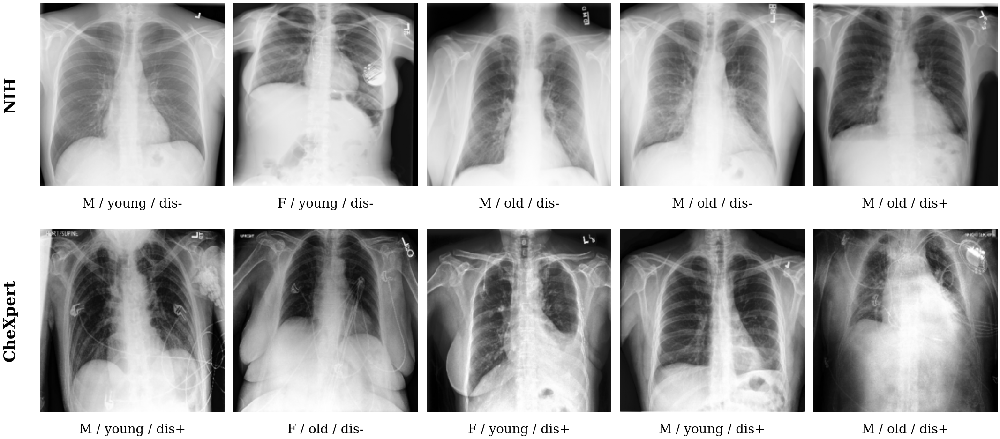

# Results

All figures and tables generated by the reproducibility notebook, exactly as used in the paper.

## Figures (`figures/`)

12 figures, each saved as both `.pdf` (vector, for LaTeX inclusion) and `.png` (300 DPI, for quick viewing).

**Sample chest radiographs (Fig. 0)** — one row per dataset, five randomly selected patients per row, annotated with sex / age-group / disease-status labels:

| File | Paper reference | Description |
|---|---|---|
| `fig0_sample_cxrs` | Fig. 1 | Sample chest radiographs with demographic/disease labels |
| `fig1_leakage_auroc` | Fig. 2 | H1 — demographic leakage AUROC per model/target, with significance |
| `fig2_h2_forest_plot` | Fig. 3 | H2 — forest plot, BioMedCLIP vs. natural-image baselines |
| `fig3_amplification_vs_pixels` | — | Foundation-model leakage vs. pixel-PCA baseline (supporting) |
| `fig4_reliability_diagrams` | Fig. 4 | Reliability diagrams by demographic subgroup |
| `fig5_ece_gap_matched` | Fig. 5 | H3a — prevalence-matched ECE gap, sex vs. age axis |
| `fig6_exploratory_crossmodel` | Fig. 6 | H3b — cross-model leakage vs. calibration gap (exploratory) |
| `fig7_crossdataset_replication` | Fig. 7 | Cross-dataset replication, NIH vs. CheXpert |
| `fig8_replication_consistency` | Fig. 8a | Replication-consistency scatter |
| `fig9_ablation_before_after` | Fig. 9 | H4 — INLP ablation: gap before/after + sanity-check trace |
| `fig10_jackknife_robustness` | Fig. 8b | Leave-one-model-out jackknife on the H3b correlation |
| `fig11_age_dose_response` | Fig. 11 | Age dose-response (quartile ECE) |

## Tables (`tables/`)

- **`main/`** — Tables 1–4, exactly as they appear in the paper (leakage AUROC, H2 comparisons, calibration gaps, H4 ablation).
- **`supplementary/`** — Tables 5–7, robustness analyses referenced in the paper's text and discussion but not reproduced as full tables in the paper body (jackknife, age dose-response, multi-seed stability).

Each table is provided as both `.csv` (for analysis/inspection) and `.tex` (booktabs-formatted, ready to `\input{}` into a LaTeX document).
